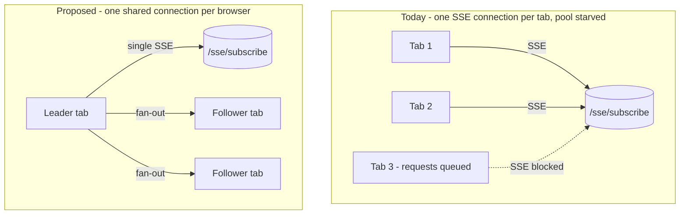
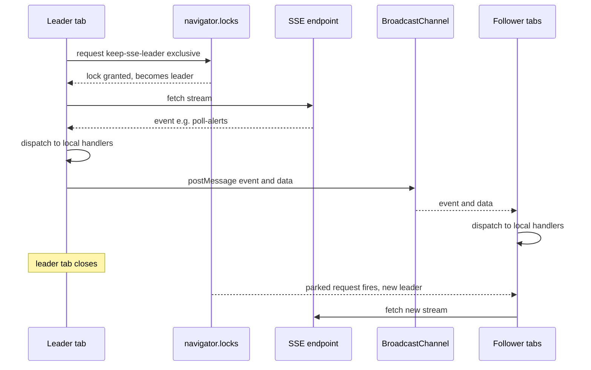

# Cross-Tab SSE Connection Sharing

> Design document — fix for "feed/preset page loads infinitely in the Nth duplicated browser tab"

## Intro

### The problem

When a user opens the alerts **feed** (or any **preset**) page and then duplicates that
browser tab a few times, one of the later tabs never finishes loading — it sits on the
spinner / table skeleton forever instead of showing the alerts table. The first one or two
tabs work fine; a subsequent duplicate hangs indefinitely. Reloading the stuck tab does not
reliably help, and closing other tabs makes it spring back to life — a strong hint that the
tabs are competing for a shared, finite resource.

The shared resource is **browser network connections**. Keep's real-time updates are
delivered over Server-Sent Events (SSE): the page opens a long-lived streaming HTTP request
to the backend and keeps it open to receive live alert/incident updates. The hook that
manages this connection (`utils/hooks/useSSE.ts`) opens the stream once per tab and
**intentionally never closes it** — see the comment at `useSSE.ts:193`
(*"No cleanup on unmount — the connection is global and must persist"*). The "global"
connection is a module-level singleton, which in the browser means **one connection per
tab**, not one per browser. There is no machinery anywhere in the codebase to share a single
connection across tabs (verified: no `SharedWorker`, `BroadcastChannel`, or `navigator.locks`
usage exists in the repo today).

Browsers cap the number of simultaneous connections to a single origin — for HTTP/1.1 the
limit is **6**. Each open feed/preset tab permanently consumes one of those slots for its SSE
stream and never gives it back. Meanwhile, a freshly duplicated tab needs several connections
*at once* during its initial load to fetch its configuration, session, presets list,
providers, facets, and the alert query results. Once the permanently-pinned SSE streams from
the already-open tabs plus the in-flight load requests exceed the per-origin cap, the new
tab's requests are **queued by the browser and never dispatched**. The data the page is
waiting on never arrives, so its loading gates never resolve:

- **Feed page** — the `feed` preset is a hard-coded default, so the page shell renders, but
  the alert query (`/alerts/query`, via `useAlertsTableData`) is stuck in the connection
  queue, so the table is locked in its skeleton/`isAsyncLoading` state
  (`widgets/alerts-table/ui/alert-table-server-side.tsx`).
- **Custom preset page** — the presets list request (`/preset`) is stuck, so
  `isPresetsLoading` stays `true`, `selectedPreset` is never found, and the page is pinned on
  the full-screen `<KeepLoader />` (`app/(keep)/alerts/[id]/ui/alerts.tsx:90` and `:159`).

The exact number of duplicates needed to trigger the hang varies with how many requests each
loading tab fires in parallel versus how many SSE streams are already pinned, but the
underlying mechanism is constant: **un-shared, never-released, per-tab SSE connections
exhaust the browser's per-origin connection pool and starve new tabs.**

### Why we got this assignment

This surfaced as a user-reported bug: opening several copies of the alerts feed — a normal
operator workflow for SOC/on-call staff who keep multiple filtered views side by side — makes
the product look broken (an infinite spinner with no error). It is a direct, reproducible
degradation of a core page (the alerts feed is the app's default landing experience; `/`
redirects to alerts/incidents), and it gets worse the more the product is used as intended
(many simultaneous views). Fixing it removes a visible reliability cliff and also reduces
unnecessary load on the backend, which today holds one open SSE stream per tab per user.

## Requirements

### Functional requirements

1. **One SSE connection per browser.** Regardless of how many tabs of Keep are open in the
   same browser profile/origin, at most **one** `/sse/subscribe` stream is open at a time.
2. **All tabs receive all events.** Every real-time event type currently handled
   (`connected`, `poll-alerts`, `incident-change`, `poll-presets`, `topology-update`,
   `ai-logs-change`, `incident-comment`, `alert-update`) must be delivered to **every** open
   tab, not only the tab that owns the underlying connection.
3. **Automatic failover.** When the tab that owns the connection is closed (or crashes),
   another open tab must take over and open a new stream within a few seconds, with no user
   action required.
4. **Duplicated tabs load normally.** With many feed/preset tabs open, a newly opened or
   duplicated tab must complete its initial load (presets, alert query) and render the table —
   i.e. the connection-pool starvation that causes the infinite load must be eliminated.
5. **Unchanged public hook API.** `useSSE()` must keep returning `{ bind, unbind }` with
   identical semantics. Its **7 consumers** must not require changes:
   `app/sse-provider.tsx`, `utils/hooks/useAlertPolling.ts`,
   `entities/presets/model/usePresetPolling.ts`, `utils/hooks/useIncidents.ts`,
   `utils/hooks/useAI.ts`, `app/(keep)/topology/model/TopologyPollingContext.tsx`,
   `features/alerts/alert-detail-sidebar/ui/alert-sidebar.tsx`.
6. **Preserve existing connection behavior.** Honor the current guards and lifecycle:
   `SSE_DISABLED` config, missing-config / `status === "loading"` early-returns, token-change
   reconnect (`useSSE.ts:43-72`), and reconnect backoff
   (`connectionAttempts`, `MAX_RECONNECT_ATTEMPTS`, `useSSE.ts:167-188`).
7. **Graceful fallback.** In a browser/context where the cross-tab coordination primitives
   are unavailable, the system must fall back to today's behavior (one connection per tab)
   so real-time updates still work — just without cross-tab sharing.

### Non-functional requirements

- **Backward compatibility:** No changes to the SSE wire protocol or the backend
  `/sse/subscribe` endpoint. This is a client-only change.
- **Event integrity:** Event ordering within a single stream must be preserved when fanning
  out to other tabs; no event deduplication regressions for handlers that are bound in
  multiple tabs.
- **Latency:** Cross-tab fan-out must be effectively instant (sub-frame); `BroadcastChannel`
  and `MessagePort` are in-process IPC and meet this trivially.
- **Resource usage:** Net reduction in open backend connections (from N-per-user-per-tab to
  1-per-user-per-browser). No busy-polling or timers for leader election.
- **Security:** Auth tokens must not be persisted to a shared, inspectable surface
  (e.g. `localStorage`) as part of coordination. Keep token handling on the main thread / in
  memory.
- **Observability:** Preserve the existing `console` diagnostics (connect, reconnect, token
  change) and add a clear log line identifying whether a tab is acting as **leader** or
  **follower**, to make the behavior debuggable in the field.

## Proposed Implementation

The fix collapses the N per-tab SSE connections into a single shared connection per browser
origin. Two designs are considered. Both keep the `useSSE()` React surface identical; they
differ only in *where the single connection lives* and *how events reach the other tabs*.



### Connection ownership & cross-tab transport

This is the core decision: which tab holds the one real connection, and how events are
distributed to the rest.

**Option A: Web Locks leader election + BroadcastChannel fan-out**

A single exclusive Web Lock acts as the leader token. Exactly one tab can hold the lock
`"keep-sse-leader"` at a time:

```js
navigator.locks.request("keep-sse-leader", { mode: "exclusive" }, async () => {
  // This callback runs ONLY in the elected leader tab.
  // Open the real SSE fetch stream here; keep the lock by returning a
  // promise that resolves only on intentional teardown (e.g. token change).
});
```

- The **leader** opens the SSE `fetch` stream (the existing `connectSSE` logic moves here).
  For each parsed event it does two things: dispatch to its own local handlers **and**
  `postMessage` the `{ event, data }` over a `BroadcastChannel("keep-sse")`.
- **Followers** never open a `fetch`. They subscribe to the same `BroadcastChannel` and feed
  incoming messages into the existing handler-dispatch map (the logic at `useSSE.ts:151-161`).
- **Failover is automatic and built-in:** when the leader tab closes, the browser releases
  its lock; a follower that is parked in `navigator.locks.request(...)` immediately has its
  callback invoked and becomes the new leader, opening a fresh stream. No heartbeats, no
  timers, no election protocol to write.
- **Token change** (prod token refresh) is handled by the leader resolving its lock-holding
  promise (releasing the lock) and re-requesting, so the connection re-elects and reconnects
  with the new token — preserving the behavior at `useSSE.ts:62-72`. Followers ignore token
  changes; they only render what the leader broadcasts.
- **Fallback:** if `navigator.locks` or `BroadcastChannel` is undefined, skip coordination
  entirely and run today's per-tab single-connection path.

Trade-offs:
- Pros: Failover is essentially free (a native side effect of lock release); no separate
  worker bundle or build config; **auth token stays on the main thread**; small, localized
  diff inside `useSSE`'s module; widely supported in current evergreen browsers; graceful
  degradation is straightforward.
- Cons: Brief (sub-second) window during leader handover where no stream is open (acceptable —
  SSE already tolerates reconnects and the backend re-emits poll events); requires two APIs
  (`Web Locks`, `BroadcastChannel`) rather than one; coordination logic lives in page JS
  (runs while at least one tab is open, which is always true when it matters).
- Complexity / risk / cost / time: **Low.** Refactor one module, add one small coordination
  module, no build/tooling changes. ~1 day including tests.

**Option B: SharedWorker owns the connection**

A `SharedWorker` is instantiated by every tab; the browser guarantees a single worker
instance shared across all same-origin tabs. The worker owns the SSE connection and relays
events to each tab over the `MessagePort` it gets per connection.

- The worker opens the single SSE `fetch` stream and `port.postMessage(...)` events to every
  connected tab.
- Tabs send the worker what it needs (API URL, auth token) over their port on connect.
- Connection lifetime tracks the worker, which the browser keeps alive as long as **any** tab
  is connected — so failover is implicit (no leader concept needed).

Trade-offs:
- Pros: Conceptually the cleanest "exactly one connection" model; no leader-handover gap; the
  worker naturally outlives individual tabs.
- Cons: Requires bundling a separate worker entry point in Next.js (non-trivial with the App
  Router / Turbopack build and asset URLs); **auth tokens must be plumbed into the worker**
  (more surface area, and care needed to avoid leaking them); harder to debug (separate
  execution context, separate console); `SharedWorker` is **not available in some contexts**
  (notably split-process incognito in some Chromium builds, and historically weaker support)
  — so a fallback path is still required, meaning we maintain *two* code paths anyway.
- Complexity / risk / cost / time: **Medium–High.** Build-tooling work plus token plumbing
  plus a fallback path. ~2–4 days with higher integration risk.

| | Option A (Web Locks + BroadcastChannel) | Option B (SharedWorker) |
|---|---|---|
| Connections per browser | 1 (with brief handover gap) | 1 (no gap) |
| Failover mechanism | Native lock release → re-election | Worker outlives tabs |
| Build/tooling changes | None | Separate worker bundle |
| Auth token location | Main thread (in memory) | Passed into worker |
| Browser support / fallback | Broad; simple fallback | Gaps; fallback still required |
| Debuggability | Page console | Separate worker context |
| Implementation risk | Low | Medium–High |

**Recommendation:** **Option A (Web Locks leader election + BroadcastChannel fan-out).** It
satisfies every functional requirement with a smaller, lower-risk, fully client-side change,
keeps auth handling on the main thread, and gets failover for free from native lock
semantics. Option B's only real advantage — no sub-second handover gap — is immaterial for a
protocol that already reconnects and re-emits state, and it costs build-tooling work and a
second code path we'd have to maintain regardless. **Per the team's request, this choice is
presented for confirmation at design review;** implementation will proceed with Option A
unless review directs otherwise. Because the public `useSSE()` API is unchanged either way,
switching to Option B later would only swap the connection-ownership internals.

### Module structure

How to introduce the coordination layer without disturbing the 7 consumers.

**Option A: Extract a connection manager module, keep `useSSE` as a thin wrapper**

- New module `utils/hooks/sseConnectionManager.ts` holds the module-level singleton state
  (handler map, `BroadcastChannel`, lock/leader lifecycle, the real `connectSSE`, reconnect
  backoff, fallback detection). It exposes `ensureConnected(token, config)`, `bind`, `unbind`,
  and teardown/token-change handling.
- `utils/hooks/useSSE.ts` becomes a thin React wrapper: it reads `useConfig()` /
  `useHydratedSession()`, applies the existing guards, calls `ensureConnected(...)` from an
  effect, and returns `{ bind, unbind }` delegating to the manager — preserving the exact
  current signature.

**Option B: Keep everything inside `useSSE.ts`**

- Add the lock/broadcast logic alongside the existing globals in the same file.

Trade-offs:
- Option A — Pros: separates transport/coordination from React lifecycle; far easier to unit
  test the dispatch/fan-out/fallback logic in isolation; keeps `useSSE.ts` readable.
  Cons: one new file.
- Option B — Pros: smallest file count. Cons: `useSSE.ts` already mixes React lifecycle with
  raw connection management; adding leader election would make it harder to read and to test.

**Recommendation:** **Option A — extract `sseConnectionManager.ts`.** The coordination logic
is non-trivial and benefits from being unit-testable without a React renderer; the wrapper
keeps the consumer-facing API identical.

### Dispatch & failover flow



## Summary

- **Chosen approach:** Share a single SSE connection across all same-origin tabs. One tab is
  elected **leader** via an exclusive Web Lock (`"keep-sse-leader"`) and owns the only
  `/sse/subscribe` stream; it fans every event out to follower tabs over
  `BroadcastChannel("keep-sse")`. Implemented by extracting a testable
  `utils/hooks/sseConnectionManager.ts` and reducing `utils/hooks/useSSE.ts` to a thin
  wrapper, leaving the `{ bind, unbind }` API and its 7 consumers untouched.
- **Key decisions:**
  1. **Web Locks + BroadcastChannel over SharedWorker** — lower risk, no build changes, token
     stays on the main thread, free native failover. *(Confirm at design review.)*
  2. **Extract a connection-manager module** so the coordination/fan-out/fallback logic is
     unit-testable and `useSSE` stays a thin React wrapper.
  3. **Graceful fallback** to today's per-tab connection when the coordination APIs are
     unavailable, so real-time updates never regress.
  4. **Client-only fix** — no change to the SSE protocol or the backend endpoint.
- **Verification plan:**
  1. Repro on the dev server (HTTP/1.1): `cd keep-ui && npm run dev`, open the feed, duplicate
     the tab 3–5×; confirm the pre-fix hang, then confirm the post-fix tabs all render.
  2. DevTools → Network: confirm exactly **one** `/sse/subscribe` connection exists across all
     open tabs (in the leader).
  3. Failover: close the leader tab; confirm a new `/sse/subscribe` appears in another tab and
     real-time continues.
  4. Fan-out: trigger a `poll-alerts` / `alert-update` event; confirm **all** open tabs update.
  5. Quality gates: `npm run typecheck`, `npm run lint`, `npm test` (existing
     `widgets/alerts-table/ui/__tests__/useAlertsTableData.test.ts` plus a new unit test for
     the connection manager's dispatch, fan-out, and fallback paths).
- **Out of scope / follow-ups:**
  - Backend-side limits on concurrent SSE streams per user (this change reduces them, but
    enforcement is a separate concern).
  - The optional defense-in-depth idea of replacing the unbounded loading spinner with a
     timeout/retry state in `alerts.tsx` / `alert-table-server-side.tsx` — not required once
     connection sharing lands; tracked as a possible follow-up.
  - HTTP/2 deployment (which would raise the per-origin connection ceiling) is not relied upon
     here; the fix is correct regardless of transport version.
```
